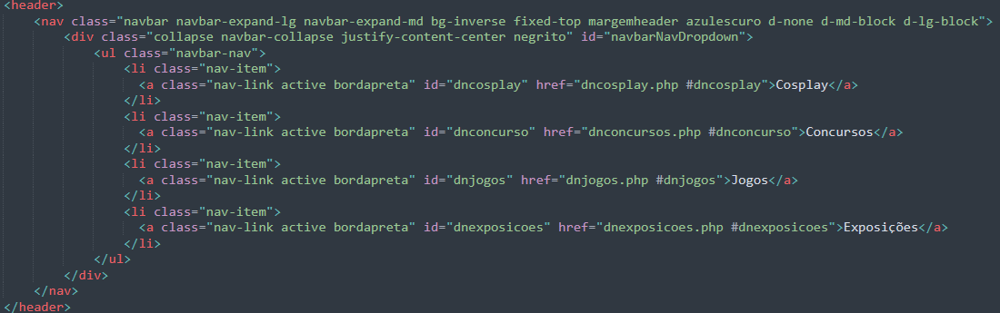
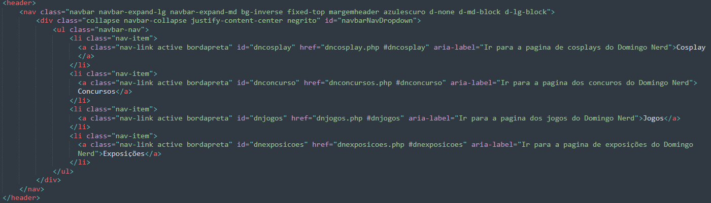

Descrição da atividade: Avaliar e modificar a navegação do projeto existente, incluindo cabeçalhos, links e menus, para torná-la mais acessível a todos os usuários, especialmente 
aqueles que utilizam tecnologias assistivas.

1. Navegação principal:

2. Subnavegação Domingo Nerd:
O código inicial que temos é a navegação secundária entre as páginas secundárias da página do evento Domingo Nerd. Essa navegação apresenta como código:

<header>
    <nav class="navbar navbar-expand-lg navbar-expand-md bg-inverse fixed-top margemheader azulescuro d-none d-md-block d-lg-block">
        <div class="collapse navbar-collapse justify-content-center negrito" id="navbarNavDropdown">
            <ul class="navbar-nav">
                <li class="nav-item">
                  <a class="nav-link active bordapreta" id="dncosplay" href="dncosplay.php #dncosplay">Cosplay</a>
                </li>
                <li class="nav-item">
                  <a class="nav-link active bordapreta" id="dnconcurso" href="dnconcursos.php #dnconcurso">Concursos</a>
                </li>
                <li class="nav-item">
                  <a class="nav-link active bordapreta" id="dnjogos" href="dnjogos.php #dnjogos">Jogos</a>
                </li>
                <li class="nav-item">
                  <a class="nav-link active bordapreta" id="dnexposicoes" href="dnexposicoes.php #dnexposicoes">Exposições</a>
                </li>
            </ul>
        </div>
    </nav>
</header>
<figure class="centropagina margem3">
    
</figure>
Cada um dos links de navegação apresentam um id que é utilizado para ativar um código no css que ajuda na identificação de qual página está sendo acessada no momento, o que auxilia tanto na navegação visual (para pessoas sem deficiência visual) onde altera a cor do link de navegação, como também na navegação com o leitor de tela que conseguiu verificar qual página está ativa/visitada e para fazer a troca de qual link quero acessar foi só usar tab para chegar no nav secundario e as setas da direita ou esquerda para trocar entre os quatro.
Porem essa configuração, ao ser lido pelo NVDA que é o leitor de tela, apresenta um problema que é facil de arrumar, onde ao ser lido os links de navegação, só fala o nome do link, exemplo: 'concursos', oque pode dificultar para quem caiu aleatoriamente em uma dessas 4 paginas (concursos, cosplays, jogos e exposições) do Domingo Nerd. Por isso houve uma pequena reformulação no código:

<header>
    <nav class="navbar navbar-expand-lg navbar-expand-md bg-inverse fixed-top margemheader azulescuro d-none d-md-block d-lg-block">
        <div class="collapse navbar-collapse justify-content-center negrito" id="navbarNavDropdown">
            <ul class="navbar-nav">
                <li class="nav-item">
                  <a class="nav-link active bordapreta" id="dncosplay" href="dncosplay.php #dncosplay" aria-label="Ir para a pagina de cosplays do Domingo Nerd">Cosplay</a>
                </li>
                <li class="nav-item">
                  <a class="nav-link active bordapreta" id="dnconcurso" href="dnconcursos.php #dnconcurso" aria-label="Ir para a pagina dos concuros do Domingo Nerd">Concursos</a>
                </li>
                <li class="nav-item">
                  <a class="nav-link active bordapreta" id="dnjogos" href="dnjogos.php #dnjogos" aria-label="Ir para a pagina dos jogos do Domingo Nerd">Jogos</a>
                </li>
                <li class="nav-item">
                  <a class="nav-link active bordapreta" id="dnexposicoes" href="dnexposicoes.php #dnexposicoes" aria-label="Ir para a pagina de exposições do Domingo Nerd">Exposições</a>
                </li>
            </ul>
        </div>
    </nav>
</header>
<figure class="centropagina margem3">
    
</figure>
Em que adicionei um aria-label para cada link, que permite colocar uma descrição/contextualização mais detalhada de onde esse link realmente leva, facilitando a localização de que pagina o usuario se localiza, ao usar o leitor de telas. Com esse aria-label deixei claro que são links relacionados ao evento Domingo Nerd e não a outro evento ou pagina.

3. **Subnavegação** das páginas da **Fatecon** e otimização da navegação via leitor de tela da página principal de **Notícias** e das páginas **Artistas** e **Concursos** da Fatecon :

**Subnavegação da Fatecon:**<br> O sub-menu das páginas da Fatecon foram feitos com base no bootstrap então a navegação via leitor de tela está ocorrendo da forma correta, porém a leitura da tela somente com o nome dos links gera uma certa confusão ao saber em qual menu o usuário está, então adicionei um aria-label mais descritivo para que o usuário esteja orientando sobre onde ele realmente está navegando, segue um dos itens como exemplo:<br>
```
<a aria-label="Para acessar a página de concursos da Fatecon" class="nav-link active bordapreta" id="fc" href="fconcurso.php#fc">Concursos</a>
```
E logo acima foi colocado outro aria-label para indentificar em qual menu o usuário está: 
```
<nav aria-label="Sub-Menu de Navegação das Páginas da Fatecon"  class="navbar navbar-expand-lg navbar-expand-md bg-inverse fixed-top margemheader azulescuro d-none d-md-block d-lg-block">
```
**Otimização da navegação via leitor de tela da página principal de **Notícias** e das páginas **Artistas** e **Concursos** da Fatecon:**<br>
Nas três páginas em questão existem imagens com títulos, porém os titulos também estão na descrição da imagem o que torna estas páginas mais **verbosas** e cansativas de se ler através do leitor de tela, então decidi esconder estes títulos para o leitor de tela via **aria-hidden** como descrito no código abaixo como exemplo: 
```
<h3 aria-hidden="true" class="tituloimg">Ilustração do Cascão Turma da Mônica</h3>
```
Também foi adicionado elementos html a conteúdos do site que poderiam ter uma semântica mais forte com `<header>` e `<footer>`:
```
<header>
<h2 class="fontt">Mushi Indeciso</h2>
<figure class="figure col-6 imgleft figuremargin">
<h3 aria-hidden="true" class="textoimg">Retrato Mushi Indeciso</h3> 
<a href="#"></a>
<figcaption class="figure-caption text-right">Fonte: Imagem do Instagram de Mushi Indeciso.</figcaption>
</figure>
</header>
```
```
<footer>
<h3 class="fontd">Redes Sociais: </h3>
<div class="tag">
<a class="item" href="https://www.instagram.com/mushi.indeciso/"><i class="bi bi-instagram"></i></a>
</div>
</footer>
```
Já nas página de Notícias os botões **Ler mais** confundem os usuários de leitores de tela, então adicionei um texto mais descritivo para que eles possam indentifiar melhor sobre o que o botão se trata: <br>
```
<a aria-label="Ler mais sobre a notícia 6 jogos RPGs curtos para terminar a campanha em até 20 horas" class="btn btn-primary" href="https://www.tecmundo.com.br/voxel/281995-6-rpgs-curtos-zerar-20-horas.htm">Ler mais</a>
```
**Headings:**<br>
Em relação aos headings no caso destas três páginas em questão, eles foram analisados e não indentifiquei nenhum problema semântico ou de ordem neles.

4. Subnavegação CCXP:
<h1>Atividade 04 - Relatório Acessibilidade</h1>

<p>Avaliar e modificar a navegação do projeto existente, incluindo cabeçalhos, links e menus, para torná-la mais acessível a todos os usuários, especialmente aqueles que utilizam tecnologias assistivas.</p><br>
<p>Antes o código estava escrito de uma maneira menos descritiva, onde o leitor de tela passava pelos botões de navegação e apenas informava que era um link, sem uma descrição detalhada de que exatamente era esse link e para onde ele redirecionava nas páginas</p>

 código antes:
 

 <p>Após algumas alterações foram adicionados ao código os elementos de WAI-ARIA, adicionando o elemento "aria-label" onde foi adicionado uma descrição para cada link, detalhando o que era e para onde redirecionava, melhorando a acessibilidade pelo leitor de tela e para pessoas com deficiência visual</p>

 código depois:
 

 
5. Navegação footer:
   
**Footer:**

Refeito o código do footer utlizando colunas e  @media para que fique semântico.
Nos links para páginas de contato e normas, utilizei aria-label para descrever que se trata de um link que direciona para outra página.
Nos ícones para as redes sociais, foi adicionado também aria-label nos links para identificar que se trata de um link que direciona as respectivas redes sociais, como facebook, youtube e instagem. Foi utilizado também o elemento aria-hidden="true" nos ícones para ocultar estas informações para os leitores, mas não visualmente.

Código do footer anterior:


Código do footer com as alterações:
