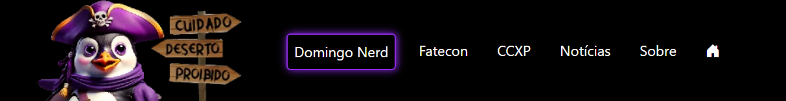
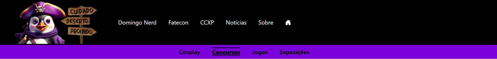
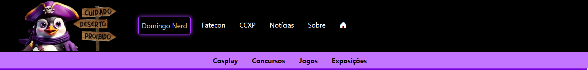
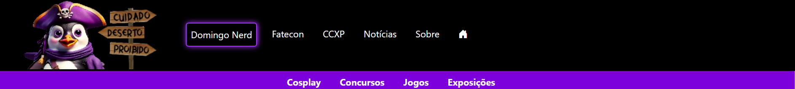
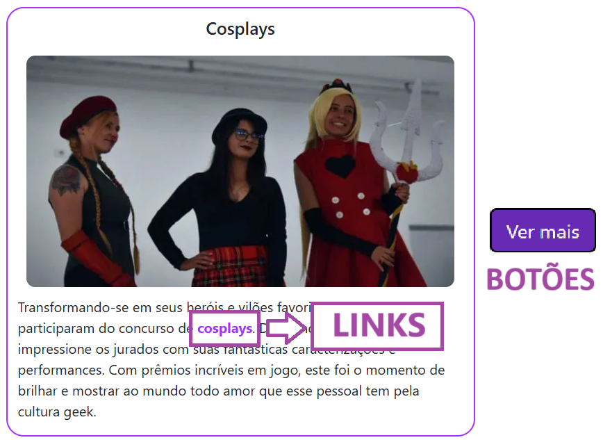

Descrição da atividade: Ajuste das cores e do contraste no projeto.

 1. Navegação principal: 

Ao ser avaliado a navegação principal, a cor do fundo é #000000 (black) e das letras é #ffffff (white) que já sao acessiveis nessa combinação. Porem oque deve ser avaliado na navegação principal é a acessibilidade do elemento que identifica em que pagina o usuário esta, esse elemento esta no com a cor #8A2BE2 que tendo background black não é acessivel.

Por isso, usando o Webaim foi testado algumas cores e a que deixou mais acessivel foi a cor #B77DED que é um pouco mais clara e apresenta um Contrast Ratio de 7.16:1. A exemplo temos a foto a seguir mostrando a alteração.

 2. Sub-navegação

De começo temos o subnav das paginas Domingo Nerd, Fatecon e CCXP que apresentam como padrão a cor de background: #a533ff e a letra em preto (black), que ao jogar no webaim mostra que o contraste para a junção das duas cores, ao ficar em negrito, apresenta problema pois fica dificil de ver as palavas. A seguir a imagem de exemplo:

Para resolver essa situação temos duas opções, deixar o fundo mais claro ou deixar a letra mais clara, onde ao deixar o fundo claro podemos usar a cor #C375FF (cor o Webaim diz que fica bom em todos os quesitos para manter a letra em black e negrito) ou manter a cor do fundo em #6E1ABC e deixar as letras em branco(white), exemplo:

- Mudando cor do fundo para #C375FF:

Que apresenta de Contrast Ratio: 7.3:1

- Mudando cor da letra para white e o fundo com a cor #7600D1:

Que apresenta de Contrast Ratio: 7.8:1
Ao discutir com o grupo, a escolha que melhor encaixa é apenas a alteração de cor da letra para white, pois se não teria que alterar tanto a cor padrão em diversos outros elementos do site.

 3. Domingo Nerd:

Ao se analisar as paginas que contem no Domingo Nerd, como pagina principal, concursos, jogos, cosplays e exposições, são poucas as possiveis alterações de cor que devem avaliadas, por exemplo as cores dos botões, bordas e cores de links. Temos como exemplo a imagem a seguir:

Onde a borda do elemento com cor #A533FF apresenta Constrast Ratio de 4.64:1 que não fica valida no AAA pelo WebAIM por isso alterei para a cor #7C00DB com Contrast Ratio de 7.29:1.  
O link com cor #A533FF apresenta Constrast Ratio de 4.64:1 que não fica valida no AAA pelo WebAIM para linhas finas, porem ainda é usual para o objetivo do portal. 
Por ultimo o botão com cor #662BB2 e letra branca apresenta Contrast Ratio de 8.22:1 que é acessivel em todos os sentidos, acaba sendo o mesmo resultado com a cor do botão #662BB2 e a cor do background da pagina que é branco que apresenta Contrast Ratio de 8.22:1. 

 4. Avaliando e corrigindo contraste de cores das páginas Notícias e Fatecon

- Página Notícias

`-Cor de Fundo: ffffff / Cor das letras: 212529 | Contrast Ratio 15.42:1`   
``-Cor do Botão: 662bb2 / Cor da Letras no Botão: ffffff | Contrast Ratio 8.22:1``   
``-Cor do Botão: 662bb2 / Cor de fundo: ffffff | Contrast Ratio 8.22:1``   
``-Cor das Bordas de Detalhe: 662bb2 / Cor de fundo: ffffff | Contrast Ratio 8.22:1``   

- Página Artistas Fatecon

``-Cor de Fundo: ffffff / Cor das letras: 212529 | Contrast Ratio 15.42:1``   
``-Cor das Bordas de Detalhe: 662bb2 / Cor de fundo: ffffff | Contrast Ratio 8.22:1``   
``-Cor de Fundo do Menu Secundário: 7600d1 / Cor da Letra: ffffff | Contrast Ratio 7.8:1``   

- Página Concursos Fatecon

``-Cor de Fundo: ffffff / Cor das letras: 212529 | Contrast Ratio 15.42:1``   
``-Cor das Bordas de Detalhe: 662bb2 / Cor de fundo: ffffff | Contrast Ratio 8.22:1``   
``-Cor de Fundo do Menu Secundário: 7600d1 / Cor da Letra: ffffff | Contrast Ratio 7.8:1``   

- Resumo sobre o contraste 
Todas a cores tem um nível de contraste adequado quando colocadas lado a lado o que de torna o site acessível para pessoas com deficiência visual, assim como todos os textos das páginas em questão que possuem um nível de contraste considerado bom.

- Testes de Acessibilidade: 
Foram rodadas as ferramentas Google Light House e Axe para verificar o nível de acessibilidade do Website o que gerou alguns erros não percebidos anteriormente e que logo foram corrigidos e atingiram um nível de pontuação bom.

> **Observações:** 
Neste mesmo trabalho foi realizada a alteração nos contrastes das páginas e também foram feitas alterações em elementos de códigos que não eram considerados acessíveis.

 Analise e correção de cores das paginas Fatecon (Home), Fatecon Jogos e Workshops.

Fatecon (Home):

- Em relação a pagina da Fatecon(Home) foram somente uma mudança necessária para atingir os padrões de cores AAA no caso a cor dos detalhes e dos botões alterando de #8A2BE2 para #662bb2, mantendo todas as outras cores, o fundo como #ffffff e a cor das letras como #000000.

- Na cor do Menu secundário alteramos a cor de fundo, foi substituído a cor #a533ff pela cor #7600D1 para melhorar a visibilidade mantendo a cor das letras #ffffff.

Jogos (Fatecon): 

- Em relação a pagina da Jogos(Fatecon) foram somente uma mudança necessária para atingir os padrões de cores AAA no caso a cor dos detalhes e dos botões alterando de #8A2BE2 para #662bb2, mantendo todas as outras cores, o fundo como #ffffff e a cor das letras como #000000.

- Na cor do Menu secundário alteramos a cor de fundo, foi substituído a cor #a533ff pela cor #7600D1 para melhorar a visibilidade mantendo a cor das letras #ffffff.

Workshops (Fatecon): 

- Em relação a pagina da Jogos(Fatecon) foram somente uma mudança necessária para atingir os padrões de cores AAA no caso a cor dos detalhes e dos botões alterando de #8A2BE2 para #662bb2, mantendo todas as outras cores, o fundo como #ffffff e a cor das letras como #000000.

- Na cor do Menu secundário alteramos a cor de fundo, foi substituído a cor #a533ff pela cor #6E1ABC para melhorar a visibilidade mantendo a cor das letras #ffffff.

Por tanto a principal mudança realizada em todas as páginas foi a alteração das cores #8A2BE2 e #a533ff para a cor #7600D1, foram realizados também algumas alterações visando melhorar a acessibilidade em todas as páginas a cima.

 5. Páginas da CCXP

Ao passar no software Lighthouse, ele deu alertas apenas no subnav das páginas

O Nav secundário das páginas da CCXP no começo eram de cor roxo escuro no background(#8a2be2) e a letra na cor preta(black). Ao passar o site no Google Lighthouse, emitiu um alerta de contraste das cores, que pode ter falhas na leitura, principalmente para as pessoas deficientes.

entre algumas soluções, encontramos a possibilidade de mudar do background para um outro tom de roxo(#6E1ABC) e a cor dos botões para White(#FFFFFF).

ou também podemos deixar o fundo mais claro, dando um melhor contraste para as letras na cor preta, facilitando a leitura para as pessoas deficientes visuais.

No restante das páginas, de Entrevistas, Cosplyas, eSports, Artistas e página principal da CCXP não hove qualquer alerta de contraste avisando da necessidade de mudança de cor, assim, permanecendo nas seguintes cores:
 
<ul>
  <li>Cor do Background: Branco(#FFFFFF)</li>
  <li>Cor dos Botões: Roxo escuro(#662bb2) com textos em branco(#FFFFFF)</li>
  <li>Cor das Bordas: Roxo(#8a2be2) solid de 2px</li>
  <li>Cor dos Textos: Textos principais  de cor preta, títulos em Negrito(Bold).</li>
</ul>

6. Footer

As cores de fundo e de do texto não possuem uma taxa de contraste suficiente. Texto de baixo contraste é difícil ou impossível de ler para muitos usuários. 
Realizada alteração da cor da fonte de #8A2BE2 para #C375FF, obtendo um maio contraste com a cor de fundo e obtendo uma avaliação AAA no webaim.

